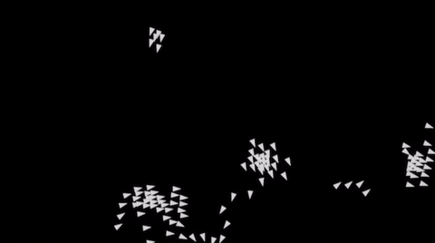

## Jiaxun Yang

Hello! I'm Jiaxun, also known as Kevin.

I am on a path toward graphics programming and game development.

Currently:
- Building an indie game in Unity
- Looking for opportunities in the game industry

### About Me

I graduated with a bachelor's degree in Astronomy and Astrophysics and transitioned into computer graphics and game development.

I enjoy creating gameplay systems, and I'm also interested in rendering, physics simulation, and game engine technology. I enjoy implementing graphics and simulation techniques from research papers and applying them to interactive applications and games.

### Featured Projects

- [AkuaEngine: Position Based Fluid Simulation](https://github.com/kevinyangjx/AkuaEngine)

- [Docking Engaged (game demo)](https://kevinyangjx.itch.io/docking-engaged)

- [Boids](https://kevinyangjx.github.io/boids-webgl/)

- Ray Marching

Languages: C++, C\#, Python, Java

Graphics: OpenGL, CUDA

Development: Unity, Git

### Contact

Email: kevin.graphics.dev@gmail.com
